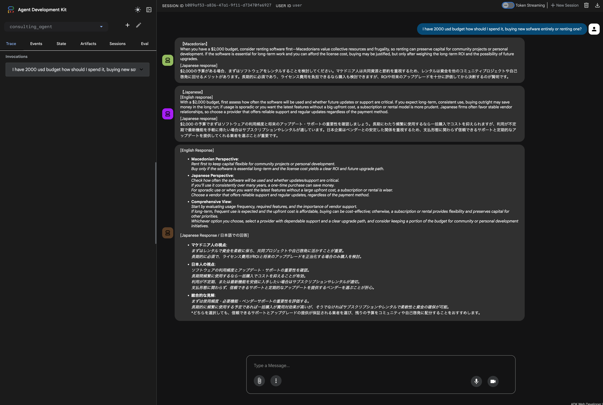

# Multi-Agent Consultation System
A bilingual consultation system powered by [Google ADK (Agent Development Kit)](https://google.github.io/adk-docs/) that provides perspectives from multiple cultural viewpoints in both English and Japanese.



## Overview
This system consists of three main components:
- **Macedonian Agent**: Provides opinions based on Macedonian culture and values
- **Japanese Agent**: Provides opinions based on Japanese culture and values
- **Synthesis Agent**: Objectively integrates both perspectives into a comprehensive answer

The root agent coordinates parallel execution of the cultural agents and synthesizes their responses into a balanced, bilingual final answer.

## Architecture

```
User Question
     ↓
root_agent (Sequential)
     ↓
parallel_consultation_agent (Parallel)
     ├─→ macedonian_agent
     └─→ japanese_agent
     ↓
synthesis_agent
     ↓
Bilingual Final Answer
```

## Prerequisites

- Python 3.13.5 or higher
- [uv](https://github.com/astral-sh/uv) package manager
- Install Ollama on your local machine or server. Follow the instructions at [Ollama Installation Guide](https://docs.ollama.com/).

## Setup

### 1. Install Dependencies

```bash
uv sync
```

### 2. Configure Environment Variables

Create or edit `consulting_agent/.env`:

```env
MODEL_NAME=ollama/gpt-oss:20b
API_BASE_URL=http://127.0.0.1:11434
```

Adjust the values according to your Ollama setup:
- `MODEL_NAME`: The Ollama model name (e.g., `ollama/gpt-oss:20b`, `ollama/deepseek-r1:70b`)
- `API_BASE_URL`: Your Ollama server URL

### 3. Start Ollama Server

If Ollama is not already running, start the Ollama service:

```bash
# Start Ollama server
ollama serve
```

The server will start on `http://127.0.0.1:11434` by default.
If you access Ollama from a different machine, change the bind address with the OLLAMA_HOST environment variable.([How can I expose Ollama on my network?](https://docs.ollama.com/faq#how-can-i-expose-ollama-on-my-network))

In a separate terminal, pull the required model if you haven't already:

```bash
# Pull the model (example: gpt-oss:20b)
ollama pull gpt-oss:20b

# Or pull another model
ollama pull deepseek-r1:70b
```

### 4. Verify Ollama Server

Ensure your Ollama server is running and accessible:

```bash
curl http://127.0.0.1:11434/api/tags
```

You should see a list of available models.

## Usage

### CLI Mode

Activate the virtual environment and run the agent:

```bash
. .venv/bin/activate
adk run consulting_agent
```

Then enter your questions at the prompt.

### Web Interface

Launch the web interface on a specific port:

```bash
. .venv/bin/activate
adk web --port 8000
```

Access the interface at `http://localhost:8000`

## Response Format

### Sub-Agent Responses

Each cultural agent responds in this format:

```
【Macedonian】
[English response]
<English perspective from Macedonian viewpoint>


[Japanese response]
<マケドニアの視点からの日本語回答>
```

### Final Synthesis

The synthesis agent provides a comprehensive summary:

```
[English Response]
- 【Macedonian Perspective】: (key points)
- 【Japanese Perspective】: (key points)
- 【Comprehensive View】: (objective conclusion)

[Japanese Response / 日本語での回答]
- 【マケドニア人の視点】: (要点)
- 【日本人の視点】: (要点)
- 【総合的な見解】: (統合された結論)
```

## Project Structure

```
consulting-agent/
├── consulting_agent/
│   ├── __init__.py
│   ├── agent.py          # Main agent definitions
│   └── .env              # Environment configuration
├── pyproject.toml        # Project dependencies
├── README.md
└── .venv/                # Virtual environment
```

## Dependencies

- **google-adk**: Agent Development Kit framework
- **litellm**: LLM integration library for Ollama
- **python-dotenv**: Environment variable management

## Troubleshooting

### Import Errors

If you encounter import errors, ensure all dependencies are installed:

```bash
uv sync
```

### Connection Issues

Verify your Ollama server is running and the `API_BASE_URL` in `.env` is correct.

### Model Not Found

Check that the specified model is available in your Ollama installation:

```bash
ollama list
```
